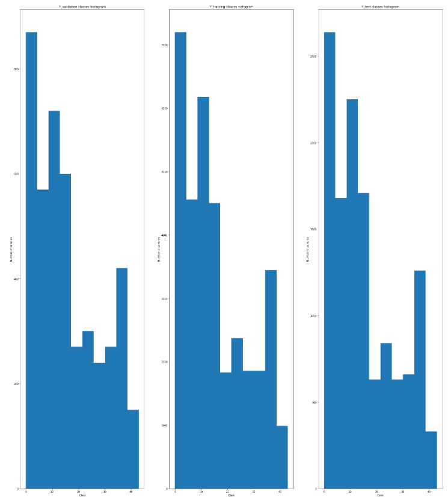

# **Traffic Sign Recognition** 

## Writeup

### You can use this file as a template for your writeup if you want to submit it as a markdown file, but feel free to use some other method and submit a pdf if you prefer.

---

**Build a Traffic Sign Recognition Project**

The goals / steps of this project are the following:
* Load the data set (see below for links to the project data set)
* Explore, summarize and visualize the data set
* Design, train and test a model architecture
* Use the model to make predictions on new images
* Analyze the softmax probabilities of the new images
* Summarize the results with a written report

## Rubric Points
### Here I will consider the [rubric points](https://review.udacity.com/#!/rubrics/481/view) individually and describe how I addressed each point in my implementation.  

---
### Writeup / README

#### 1. Provide a Writeup / README that includes all the rubric points and how you addressed each one. You can submit your writeup as markdown or pdf. You can use this template as a guide for writing the report. The submission includes the project code.

You're reading it! Code is provided in the .ipynb file

### Data Set Summary & Exploration

#### 1. Provide a basic summary of the data set. In the code, the analysis should be done using python, numpy and/or pandas methods rather than hardcoding results manually.

I used the pandas library to calculate summary statistics of the traffic
signs data set:

* The size of training set is 34799
* The size of the validation set is 4410
* The size of test set is 12630
* The shape of a traffic sign image is 32x32x3
* The number of unique classes/labels in the data set is 43

#### 2. Include an exploratory visualization of the dataset.

Here is an exploratory visualization of the data set. In the picture you can find an histogram showing the distribution of the samples among the different datasets (training,validation, testing): 

The samples are unbalanced into a dataset though the sample distribution is equal for all datasets.

### Design and Test a Model Architecture

#### 1. Describe how you preprocessed the image data.
What techniques were chosen and why did you choose these techniques? Consider including images showing the output of each preprocessing technique. Pre-processing refers to techniques such as converting to grayscale, normalization, etc. (OPTIONAL: As described in the "Stand Out Suggestions" part of the rubric, if you generated additional data for training, describe why you decided to generate additional data, how you generated the data, and provide example images of the additional data. Then describe the characteristics of the augmented training set like number of images in the set, number of images for each class, etc.)

- Rescale data so pixels have values between -1 and 1. DONE
- Z-Score normalisation. NOT DONE
- Histogram pixel intensity equalization. NOT DONE
- Oversample undersampled data. DONE
- Experiment with different network architectures, or just change the dimensions of the LeNet layers DONE
- Add regularization features like drop out or L2 regularization to make sure the network doesn't overfit the training data DONE
- Tune the hyperparameters DONE

As a first step, I wondered if converting the images to grayscale might be a good idea but eventually I decided not to do so as I thought the colors may
highly increase the possibility to correctly classify a traffic sign since colors is important for that.

At first I tried oversampling the training and validation sets by settings all samples to the number of the highest frequent sample. After a few trials I realised that
the network was performing better on the untouched dataset. I wondered if the network might overfit with the oversampled dataset therefore I tried oversampling undersampled
images to the median of the number of samples per label but still I got a validation error of 0.925. The unmodified dataset was still performing better.

To do so I used a pandas dataframe which comes in handy with all its features (sampling, etc.)

I had a few more tricks up my sleeve as performing Z-Score normalisation and histogram pixel intensity equalisation but I decided to implement these in case the accuracy was not satisfying.

#### 2. Describe what your final model architecture looks like including model type, layers, layer sizes, connectivity, etc.) Consider including a diagram and/or table describing the final model.

My final model consisted of the following layers:

| Layer         		|     Description	        					| 
|:---------------------:|:---------------------------------------------:| 
| Input         		| 32x32x3 RGB image   							| 
| Convolution 5x5     	| 1x1 stride, valid padding, outputs 28x28x6 	|
| RELU					|												|
| Max pooling	      	| 2x2 stride, outputs 14x14x6   				|
| Convolution 5x5	    | 1x1 stride, valid padding, outputs 10x10x16   |
| RELU					|												|
| Max pooling	      	| 2x2 stride, outputs 5x5x16   				    |
| Fully connected		| Input 400 , output = 300 with no dropout      |			
| RELU					|												|	
| Fully connected		| Input 300 , output = 200 with no dropout      |			
| RELU					|												|			
| Fully connected		| Input 200 , output = 120 with no dropout      |			
| RELU					|												|	
| Fully connected		| Input 120 , output = 84 with dropout of 0.8   |			
| RELU					|												|	
| Fully connected		| Input 84 , output = 60 with dropout of 0.8    |			
| RELU					|												|	
| Fully connected		| Input 60 , output = 43 with no dropout        |
| Softmax				| To get class probability						|

#### 3. Describe how you trained your model. The discussion can include the type of optimizer, the batch size, number of epochs and any hyperparameters such as learning rate.

I used ADAM optimizer, varied batch size from 64 up to 512 and I've seen that 64 is the best so far. I've gone up to 100 epochs but the validation error just stays near 0.93 after epoch 80 so to avoid overfitting I stopped at epoch 80 since the training accuracy was already 1000%. I left the learning rate at 0.001

#### 4. Describe the approach taken for finding a solution and getting the validation set accuracy to be at least 0.93. Include in the discussion the results on the training, validation and test sets and where in the code these were calculated. Your approach may have been an iterative process, in which case, outline the steps you took to get to the final solution and why you chose those steps. Perhaps your solution involved an already well known implementation or architecture. In this case, discuss why you think the architecture is suitable for the current problem.

My final model results on epoch 80 were:
Training Accuracy = 1.000
Validation Accuracy = 0.943
Test Accuracy = 0.944

If an iterative approach was chosen:
I chose as first architecture the LeNet one to understand how much I've should have changed in the data and in network architecture. The validation accuracy was already very good being 0.89
* What were some problems with the initial architecture? I didn't succeed to increase the architecture until I started adding more layers, the network needed more hidden layers to learn more complex features. After adjusting the architecture by trial and error (progressively adding more hidden layers) I included a dropout rate of 0.8 for the last two but the very last fully connected layers in order to avoid overfitting. All these modifications were tested monitoring the training and validation accuracy.

The final testing accuracy together with the results on the validation accuracy show that the model generalizes well on new data giving high accuracy. 

### Test a Model on New Images

#### 1. Choose five German traffic signs found on the web and provide them in the report. For each image, discuss what quality or qualities might be difficult to classify.
Here are five German traffic signs that I found on the web:

[Speed limit (100km/h)](./00011.ppm)
./00012.ppm)

The third and fourth image highly differ from the other images in pixel intensity as they are very dark and therefore might be hard to classify
#### 2. Discuss the model's predictions on these new traffic signs and compare the results to predicting on the test set. At a minimum, discuss what the predictions were, the accuracy on these new predictions, and compare the accuracy to the accuracy on the test set (OPTIONAL: Discuss the results in more detail as described in the "Stand Out Suggestions" part of the rubric).

Here are the results of the prediction:

| Image			        |     Prediction	        					| 
|:---------------------:|:---------------------------------------------:| 
| Priority road      	| Priority road   								| 
| Speed limit (100km/h) | Speed limit (100km/h) 						|				|
| Slippery Road			| Slippery Road      							|
| Speed limit (100km/h)	| Speed limit (100km/h)					 		|
| Speed limit (70km/h)	| Speed limit (70km/h)					 		|

The model was able to correctly guess 5 of the 5 traffic signs, which gives an accuracy of 100%. This compares favorably to the accuracy on the test set of 0.946

#### 3. Describe how certain the model is when predicting on each of the five new images by looking at the softmax probabilities for each prediction. Provide the top 5 softmax probabilities for each image along with the sign type of each probability. (OPTIONAL: as described in the "Stand Out Suggestions" part of the rubric, visualizations can also be provided such as bar charts)

For all the images the neural network was 100% sure about its prediction class! The top five soft max probabilities were

| Probability			|     Prediction	        					| 
|:---------------------:|:---------------------------------------------:| 
| 100      	            | Priority road   								| 
| 100                   | Speed limit (100km/h) 						|				|
| 100			        | Slippery Road      							|
| 100	                | Speed limit (120km/h)					 		|
| 100	                | Speed limit (70km/h)					 		|

### (Optional) Visualizing the Neural Network (See Step 4 of the Ipython notebook for more details)
#### 1. Discuss the visual output of your trained network's feature maps. What characteristics did the neural network use to make classifications?

